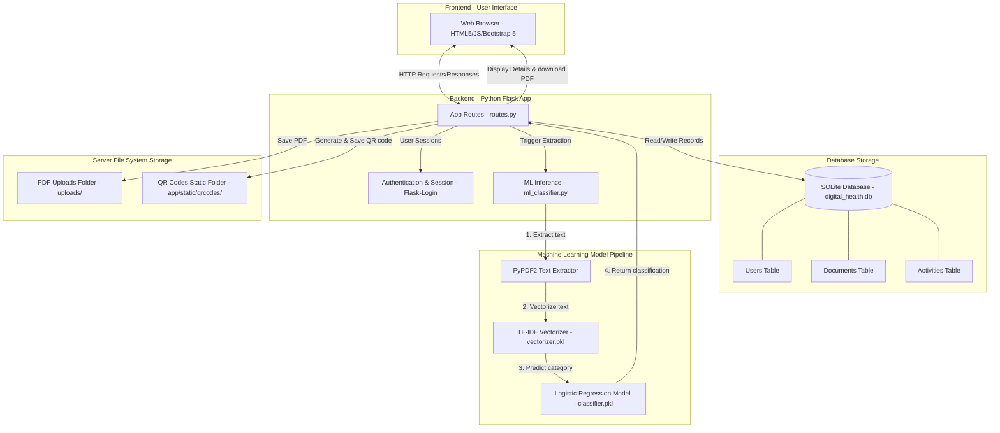

# System Architecture - Digital Health File System

Below is the high-level system architecture of the Cloud-Based Digital Health File System with ML-Assisted Document Classification.

## Architectural Components Explanation

1. **Frontend (Browser UI)**: Responsive web application powered by HTML5, JavaScript (main.js), and Bootstrap 5. Provides pages for Authentication (Login/Register), Dashboard (PDF uploader, file explorer, stats counter), and Document Details (displays classification details, text snippet, and download/share buttons).
2. **Backend Engine (Python Flask)**: Modular controller structure matching the MVC architecture patterns. Utilizes blueprints to partition authentication and main app functions. Manages database transactions, files on disk, and machine learning inferences.
3. **Database Layer (SQLite)**: Standard relational file database mapping `User`, `Document`, and `Activity` records using Python SQLAlchemy ORM.
4. **Machine Learning Pipeline**: Uses `PyPDF2` to read files on disk and extract ASCII/UTF-8 texts. The extracted string is then transformed using an offline-trained TF-IDF vectorizer and classified using a Logistic Regression model to distinguish between `Prescription`, `Lab Report`, `Scan Report`, and `Discharge Summary`.
5. **Storage System (File System)**:
   - `uploads/`: Secured top-level folder storing medical PDF files under random hashes (UUID) to prevent duplication or override vulnerabilities.
   - `app/static/qrcodes/`: Hosts PNG images containing generated QR codes mapping specific document URL endpoints for offline sharing.
