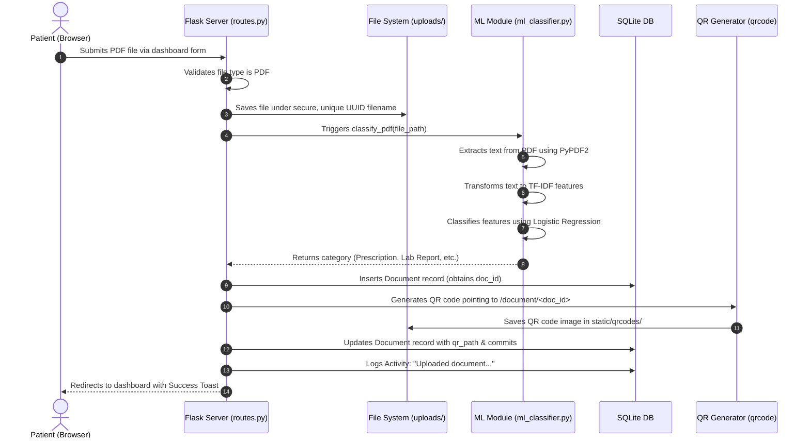
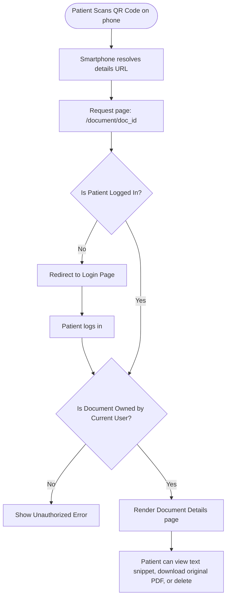

# Application Workflow Diagrams - Digital Health File System

Below are the primary workflows executed by the Digital Health File System, illustrated using Mermaid flowcharts.

---

## 1. Document Upload & Machine Learning Classification Flow

This diagram describes the sequence of actions that occur when a patient uploads a PDF medical report.



---

## 2. Authentication & Security Session Flow

This workflow illustrates how user identity is authenticated and maintained.

```mermaid
graph TD
    Start([User navigates to App]) --> IsAuth{Is Authenticated?}
    IsAuth -->|Yes| GoDash[Redirect to Dashboard]
    IsAuth -->|No| Login[Show Login Page]
    
    Login --> Register{New User?}
    Register -->|Yes| SignUp[Show Sign Up Form]
    SignUp --> SubmitSignUp[Submit Register Form]
    SubmitSignUp --> Hashing[Hash Password via PBKDF2]
    Hashing --> SaveUser[Save User to SQLite DB]
    SaveUser --> RedirectLogin[Redirect to Login with success flash]
    RedirectLogin --> Login
    
    Register -->|No| InputLogin[Enter Email & Password]
    InputLogin --> Verify{Verify Credentials?}
    Verify -->|Failed| FlashErr[Flash Error Message]
    FlashErr --> Login
    Verify -->|Passed| SessionInit[Create User Session via Flask-Login]
    SessionInit --> AuditLog[Log Activity: "Logged in successfully"]
    AuditLog --> GoDash
```

---

## 3. QR Code Access & Sharing Flow

This workflow illustrates how QR codes bridge physical reports and digital details.


